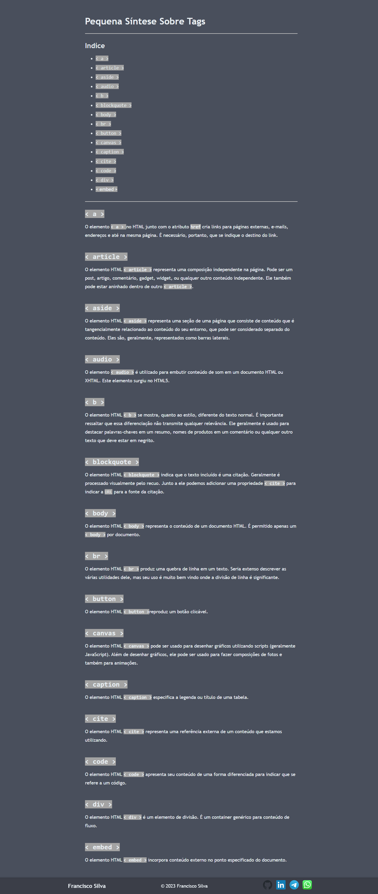

# HTML Tag Library

This project is a web-based resource that covers various HTML tags used for web development. It is built using HTML5 and CSS3 and is inspired by the Mozilla Developer Network (MDN) documentation.

## Description

The HTML Tag Library project aims to provide an easy-to-use and comprehensive resource for developers who are looking for information on HTML tags. The website covers a wide range of HTML tags and provides clear explanations and examples for each tag. The site is organized in an intuitive and user-friendly way, making it easy for users to navigate and find the information they need.

## Features

- Easy-to-use and comprehensive resource for HTML tags
- Clear explanations and examples for each tag
- User-friendly and intuitive design for easy navigation

## Technologies Used

- HTML5
- CSS3

## Usage

To access the HTML Tag Library, simply clone this repository and open the `index.html` file in your preferred web browser. The website will load automatically, and you can start browsing the different HTML tags and their explanations.

## Contributing

Contributions to this project are welcome! Feel free to fork this repository and submit a pull request with your changes.

## Credits

This project was built by [Francisco Silva](https://github.com/Burntroll).

## License

This project is licensed under the [MIT License](https://opensource.org/licenses/MIT).

## Results

Thank you for using the HTML Tag Library! We hope it will be a useful resource for your web development needs. If you have any questions or feedback, please don't hesitate to contact me.